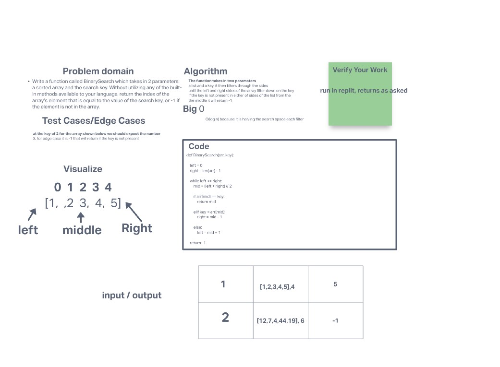

# Binary Search of Sorted Array

take in a list and use binary search basically incrimental division of sides to find the given paramater of key

## Whiteboard Process
<!-- Embedded whiteboard image -->

## Approach & Efficiency

Google,google,google

I researched what binary search was and realised that it is running through the list and deviding it down until it gets to where the paramter is asking about.

the big O is log(n) becasue it is splitting it into sections until it makes it only contain the searched peramiter
