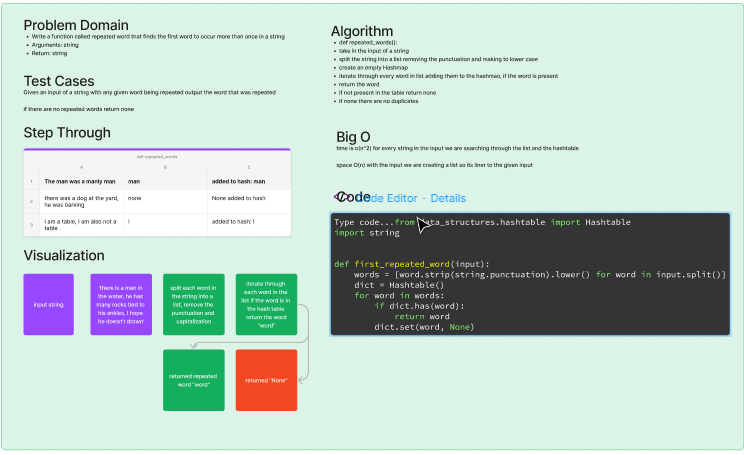

# Hash table repeat function

## Problem Domain

Write a function called repeated word that finds the first word to occur more than once in a string
Arguments: string
Return: string

## Approach & Efficiency'

def repeated_words():
take in the input of a string 
split the string into a list removing the punctuation and making to lower case
create an empty Hashmap
iterate through every word in list adding them to the hashmao, if the word is present
return the word
if not present in the table return none
if none there are no duplicates

## White Board

## Big O
time is o(n^2) for every string in the input we are searching through the list and the hashtable

space O(n) with the input we are creating a list so its liner to the given input

## link to code

[Hashtable repeated word code](../../code_challenges/hashtable_repeated_word.py)

[Hash Table Tests](../../tests/code_challenges/test_hashtable_repeated_word.py)
