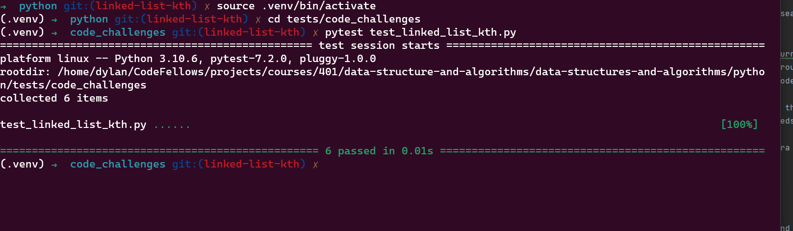

# Challenge Summary

kth from end
argument: a number, k, as a parameter.
Return the node’s value that is k places from the tail of the linked list.
You have access to the Node class and all the properties on the Linked List class as well as the methods created in previous challenges.

## Whiteboard Process

## Approach & Efficiency
used google to understand how to search through a linked list

used while loop to step through current where there is a value use for loop to move through the nodes to return the given value and kth node

time O(n) it needs to traverse to the end so its equal to the amount of nodes it needs to traverse

space is   O(0) this takes no extra space it is just finding a node

## Solution

[Linked List Kth](../../data_structures/linked_list.py)
