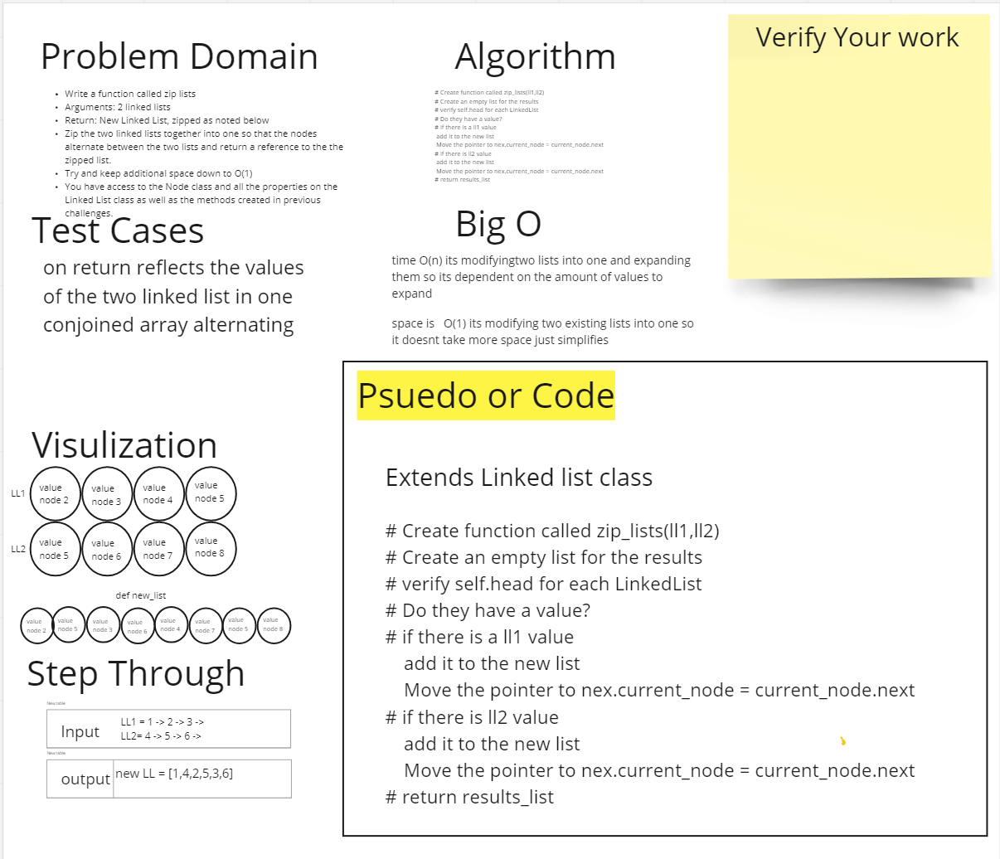

# Reverse an Array
Write a function called zip lists
Arguments: 2 linked lists
Return: New Linked List, zipped as noted below
Zip the two linked lists together into one so that the nodes alternate between the two lists and return a reference to the the zipped list.
Try and keep additional space down to O(1)
You have access to the Node class and all the properties on the Linked List class as well as the methods created in previous challenges.

## Whiteboard Process

## Approach & Efficiency

take in the paramaters of two lists
while a head is none return b 
while b head is none return a
cycles back and forth in while look appending 
list a returns with b values in order of a -b-a-b-a-b

the big O is is n for time and 1 for space becasue it is simplifying the lists into one list but is n for time because itdepends on the number of values

[Linked List zip](../../code_challenges/linked_list_zip.py)
