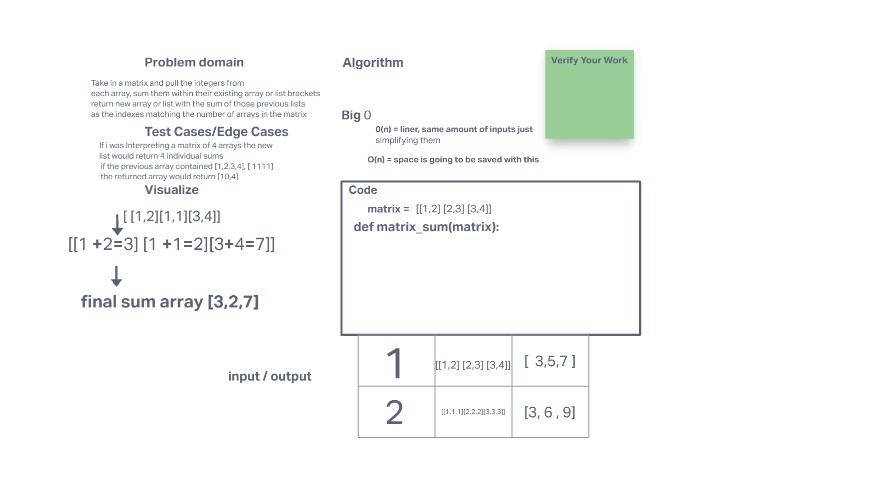

# Mock Interviews

The problem i had was to filter an matrix into one single list with the sum of the previos array being the place holder for its index of the matrix as its new index in the list

## Whiteboard Process
<!-- Embedded whiteboard image -->

## Approach & Efficiency

I did this one stright from the brain, i was confused on what we could do during the interview so my psuedo code and other things shined, where as its obvious i need more tools to build the actual code, im going to work on this problem again so that if asked again its easy

the only thing i looked up was the big O we were unclear if we had time to research or could so we tried our best and i think the pressure situation was new stressor that i felt pretty okay about i just need to improve my craft competencty
