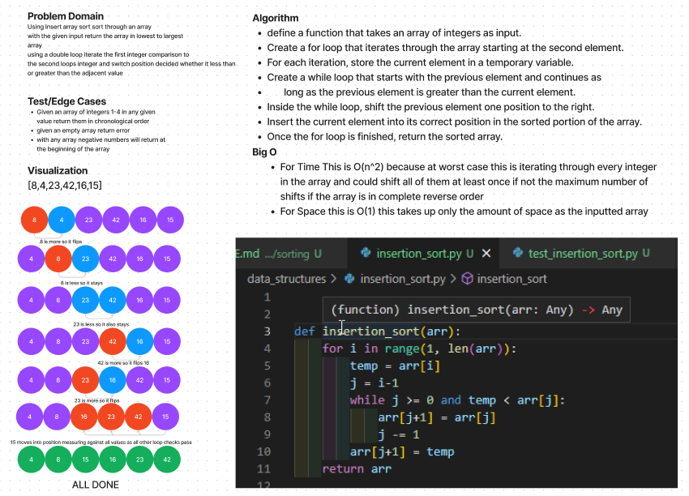

# Challenge Summary

Using Insert array sort sort through an array
with the given input return the array in lowest to largest 
array
using a double loop iterate the first integer comparison to
the second loops integer and switch position decided whether it less than
or greater than the adjacent value
 
## Whiteboard Process

## Approach & Efficiency

define a function that takes an array of integers as input.

Create a for loop that iterates through the array starting at the second element.

For each iteration, store the current element in a temporary variable.

Create a while loop that starts with the previous element and continues as long as the previous element is greater than the current element.

Inside the while loop, shift the previous element one position to the right.

Insert the current element into its correct position in the sorted portion of the array.

Once the for loop is finished, return the sorted array.

## Solution

[solved code](../../data_structures/insertion_sort.py)
