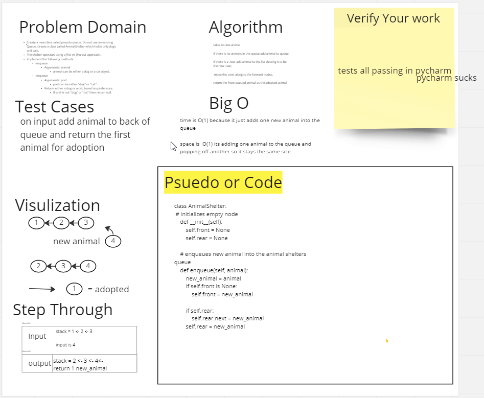

# animal Shelter

## Challenge

Create a class called AnimalShelter which holds only dogs and cats.
The shelter operates using a first-in, first-out approach.
Implement the following methods:
enqueue
Arguments: animal
animal can be either a dog or a cat object.
dequeue
Arguments: pref
pref can be either "dog" or "cat"
Return: either a dog or a cat, based on preference.
If pref is not "dog" or "cat" then return null.

## Approach & Efficiency
These structures function O(n) for time and O(1) for space they only take in one parameter at a time and they dont expand because they are returning a value after putting one in so it stays the same size but time is affected based on how many
nodes it needs to go through to get to the specified animal could be one or three or

## API
dog has animal self and next

cat has the same as dog

the dequeue and enqueue function similarly but slightly different, dequeue will take in the type of animal as a parameter
and move all of the not same type animals over to the holding pen to return the animal of choice and return the others back to the queue
the enqueue just takes the one paramter animal cat or dog and moves them into the queue or adoption line

## Code and Tests
pycharm is messed up and i dont know how to route these in
