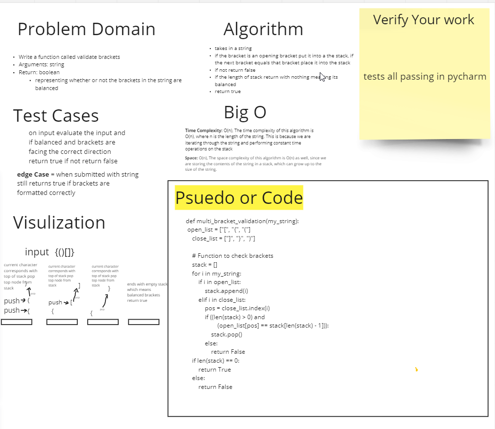

# animal Shelter

## Challenge
rite a function called validate brackets
Arguments: string
Return: boolean
representing whether or not the brackets in the string are balanced
There are 3 types of brackets:

Round Brackets : ()
Square Brackets : []
Curly Brackets : {}

## Approach & Efficiency

Time Complexity: O(n), The time complexity of this algorithm is O(n), where n is the length of the string. This is because we are iterating through the string and performing constant time operations on the stack

Space: O(n), The space complexity of this algorithm is O(n) as well, since we are storing the contents of the string in a stack, which can grow up to the size of the string.

## API
takes in a string
if the bracket is an opening bracket put it into the stack, if the next bracket equals that bracket place it into the stack
if not return false
if the length of stack return with nothing meaning its balanced
return true

## Code and Tests

