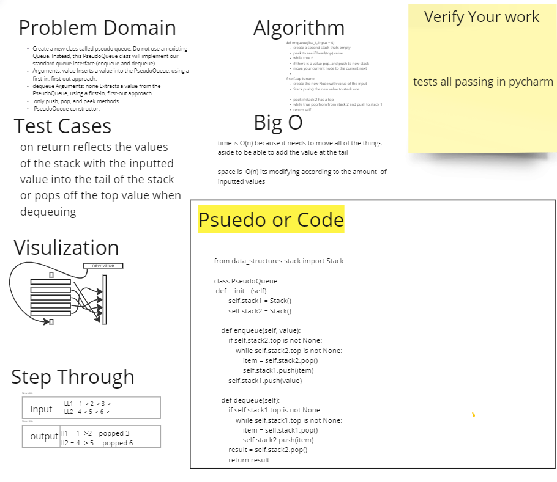

# Challenge Summary
Using methods built in our previos stack function use them to enqueue and dequeue a stack and return a popped off dequeued value as well as return a list with the input value at the tail of the stack

## Whiteboard Process

## Approach & Efficiency
the big o is o of n and o of 1 because when dequeueing we are just returning the head or top of the stack and when we are enqueuing we are moving the whole list to add on to the tail

approach is the evaluate if there is value in the stack, if so move that value and node to the other stack until the list is empty so that you are at the tail of the stack, then push the desired value to the tail of the list and then push all the information from stack 2 back on top of tha value in order so that the new value is the tail and the previous

## Solution
[tests](i dont know how to get to the routes something is wrong with pycharm)
