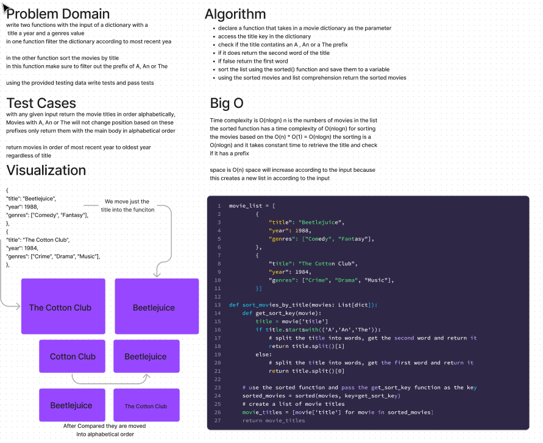

# Comparisons

write two functions with the input of a dictionary with a
title a year and a genres value
in one function filter the dictionary according to most recent yea

in the other function sort the movies by title
in this function make sure to filter out the prefix of A, An or The

using the provided testing data write tests and pass tests

## Whiteboard Process

## Approach & Efficiency

Google,google,google

- declare a function that takes in a movie dictionary as the parameter
- access the title key in the dictionary
- check if the title contatins an A , An or a The prefix
- if it does return the second word of the title
- if false return the first word
- sort the list using the sorted() function and save them to a variable
- using the sorted movies and list comprehension return the sorted movies

## The Code

[The Code](../../python/code_challenges/comparisons.py)
[The Tests](../../python/tests/code_challenges/test_comparisons.py)
