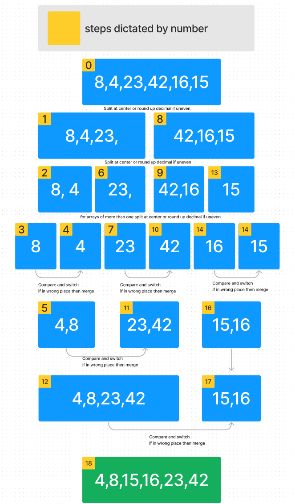

# Blog Notes: Lets Take A Look at Merge Sort

## What is Merge Sort

The general idea or merge sort comes from taking a array or list of integers and turnig them into something similar to a binary tree, Lets say we have a list or and array of six integers [4,1,2,3]

we are going to run a hot knife throught the center of the array, revealing a smaller two arrays [4,1], [2,3]

then we are gonna slice it up again right at the center(assuming its an even number), until its even smaller [4],[1],[2],[3]

if this was a bigger array and they werent all inividuals at this stage we would keep slicing them up until we had a giant list of a bunch of differnt integers represented as their own node or element.

The goal is to get the smallest comparable lists so that we can work back moving everything into place

we then take the two most adjacent, compare them, Oh is either of these numbers in the wrong place, if a number is out of place it will move into its desired position according to the sort

**Now Bear with me!!!**

I know this is getting confusing, but we are almost there, and I will break this down farther in a minute.

OK, so we are at the comparing stage we have a [4],[1],[2],[3]

we are going to take [4],[1]

[4] is in the wrong place because [1] is of lesser value, so we are going to change them to be in correct order and smash em back together [1,4]

now again with the other half

[2],[3] these are in the Right place, so they stay nad get merged back together, [2,3]

now lets move up the tree and compare these to smaller segments as they want to be back to the original size later so

we introduce these pairs to eachother [1,4],[2,3]

evaluating value and placement if they were to be merged at this moment they would be out of a sorted order, so we sort them, [4] gets moved to its desired position and we smash them
back into the original array size returning the now SORTED array MERGED back into its original format in order

return = [1,2,3,4]

---

## An example

```python

arr = [8,4,23,42,16,15]

ALGORITHM Mergesort(arr)
    DECLARE n <-- arr.length

    if n > 1
      DECLARE mid <-- n/2
      DECLARE left <-- arr[0...mid]
      DECLARE right <-- arr[mid...n]
      // sort the left side
      Mergesort(left)
      // sort the right side
      Mergesort(right)
      // merge the sorted left and right sides together
      Merge(left, right, arr)

ALGORITHM Merge(left, right, arr)
    DECLARE i <-- 0
    DECLARE j <-- 0
    DECLARE k <-- 0

    while i < left.length && j < right.length
        if left[i] <= right[j]
            arr[k] <-- left[i]
            i <-- i + 1
        else
            arr[k] <-- right[j]
            j <-- j + 1

        k <-- k + 1

    if i = left.length
       set remaining entries in arr to remaining values in right
    else
       set remaining entries in arr to remaining values in left

````


## Lets Demonstrate



## Now using all we have learned lets write an algorithm

```python

def merge_sort(arr):
    if len(arr) <= 1:
        return arr
    middle = len(arr) // 2
    left_half = arr[:middle]
    right_half = arr[middle:]
    left_half = merge_sort(left_half)
    right_half = merge_sort(right_half)
    return merge(left_half, right_half)

def merge(left_half, right_half):
    result = []
    i = 0
    j = 0
    while i < len(left_half) and j < len(right_half):
        if left_half[i] < right_half[j]:
            result.append(left_half[i])
            i += 1
        else:
            result.append(right_half[j])
            j += 1
    result += left_half[i:]
    result += right_half[j:]
    return result

arr = [8, 4, 23, 42, 16, 15]
print(merge_sort(arr))

```

We Threw this code in and built some test and with any given array they return our expected sorted array
so we know we have successfully written merge sort

[Merge Sort Code](../../python/data_structures/sorting.py)

[Tests For Merge Sort](../../python/tests/data_structures/test_sorting.py)
